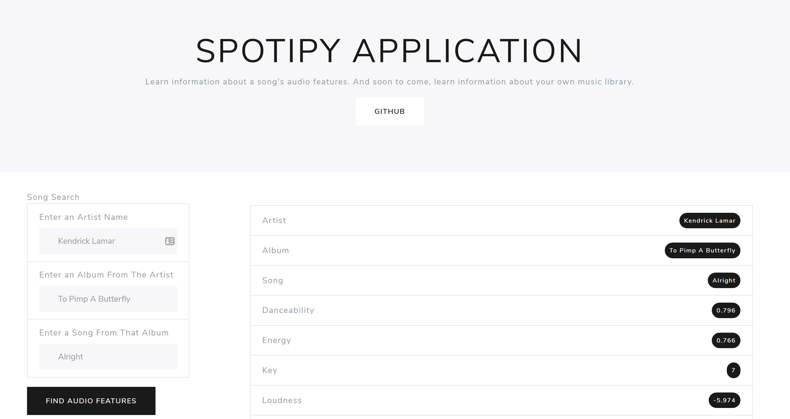

# Testing the Spotify Web API with Spotipy Wrapper

## Obtain information about the the audio features of songs given a user's input.
### Note some issues may result if an album is too far back in the artist's discography or if the artist is not the first result when searched on Spotify. I will attempt to fix this issue as soon as I can.
### Album and Song inputs do not need to be exact. As long as the input string is included in the Album/Song name on Spotify's database, it will most likely pick the correct album. This could cause issues with deluxe releases and anniversary editions since they may appear first, but sonically, the music should be similar enough that the audio features do not differ significantly.

This application was made using the [Spotipy Wrapper](https://spotipy.readthedocs.io/en/latest/) for [Spotify's Web API](https://developer.spotify.com/documentation/web-api/quick-start/).
